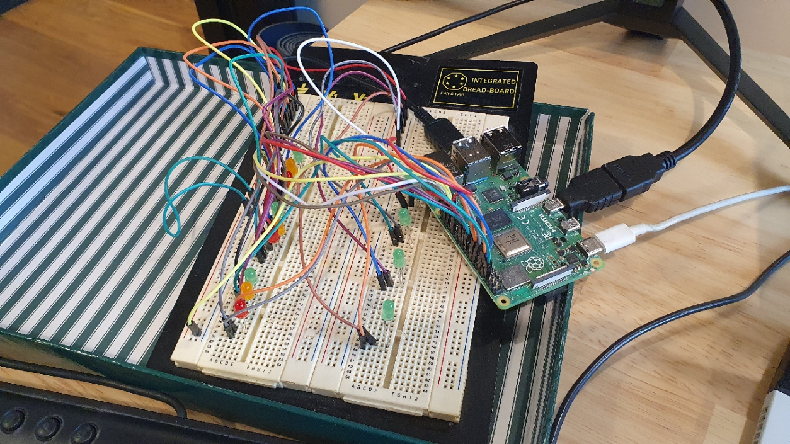

# picogrid
RaspberryPi kit

## picogrid monitor
In the ioen-app holochain folder run ``` npm run start:picogridhapp ``` to start a conductor for pico-grid

In the /server folder

``` npm run picogrid:serve ```

then in root folder ``` cargo run ```

Rust app does 5 signals to the node server that creates a new agent and gives them a profile, then logs to console to the energy data.

## introduction
the PicoGrid provides a software and physical simulation of a grid that is buying and selling of energy.
it allows a developer to configure their specific application and energy trading scenario in software and physically in a safe environment without the constraints of a real grid.
build and evaluate your application here using this tool and the IOEN protocol.

we will also provide some discovery and community tools so you can test, try and connect to others using and developing applications on PicoGrids around the world.

## logical setup
here we provide a step by step instruction to build and customize a physical grid as well as software for managing, monitoring, and creating markets, applications and interactions within that grid.
the basic setup creates a 'grid' with the following Agents:

- Energy Consumer 1 (i.e. Home 1)
- Energy Consumer 2 (i.e. Home 2)
- Energy Consumer 3 (i.e. Home 3)
- Energy Storage 1 (i.e. Home Battery System)
- Energy Storage 2 (i.e. a neighbourhood Battery)
- Energy Generation 1 (i.e. Home Solar System)
- Energy Generation 2 (i.e. Community Solar System)

Note the agents above are generic actors and can be used to represent unique elements of your scenario.  In our default example they simulate 3 homes and some neighbourhood renewable services but you may with to have them represent whatever you like.

## physical setup
The build provides a physical representation of the above with LED's for the various agents and their states.
From a physical point of view all you will need is:

- a raspberry Pi 3 or 4
- 13 LEDs
- some wires
- a breadboard

we outline the exact components and how to put them together in the documentation but also intend to have a pre-build kit version available on our Merch store.



### Energy Consumer Setup
For each of the energy consuming devices (Home1 --> Home3) we have 3 LED to show where the energy is coming from for that agent at that time. The RED LED lights when the agent is consuming power from the GRID
The ORANGE LED lights when the agent is consuming power from an Energy Storage Device (battery)
The GREEN LED lights when the agent is consuming power from an Energy Generation Device (solar)

### Energy Storage Setup
There are two batteries (storage devices) in our setup.  Each is represented by a single GREEN LED.
If the LED is flashing then the device is charging (buying) or discharging (selling)
If the LED is Solid the device has energy available
If the LED is Off the device is empty

### Energy Generation Setup
As above.

### Raspberry Pi Wiring Setup


## software setup
The software build provides a customizable tools and interfaces for monitoring and configuring your environment and engaging your connected users.
the following tools are provided that will be of use for energy application makers:

- User Dashboard / Reporting Web Interface (for all agents)
- Holochain GUI

## to run the basic Raspberry Pi Rust emulator
there is a basic rust program to test the physical setup once you have connected it.
this basic program is a work in progress but will allow the user to:
- input the consumption average of their home
- input the capacity of their home battery
- input the capacity of the neighbourhood battery
- input generation curve data for their own solar system (24 intervals to simulate 24 hours)
- input generation curve data for their neighbourhood solar system  (24 intervals to simulate 24 hours)
once those inputs are entered you run the simple rust program on your raspberry pi and your 'grid' agents will display the consumption, purchasing and selling of energy.

specifically you will see:
- the GRID, BATTERY, or SOLAR led will illuminate on Home 1 depending on where energy is being sourced for that interval
- the Home 1 will self consume from solar first, next it will get its energy from it's own battery, if doesnt have enough it will get it from the grid.
- conversely if Home 1 is generating more than the home is consuming it will fill the home1 battery. If the battery is full it will sell its energy to battery 2.
- when the solar and/or battery is charging or discharging for an interval it will flash on and off.

to run this program just go to the src folder and run 'physical_pico_main.rs'.
